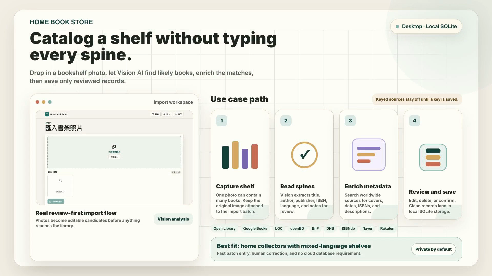

# Home Book Store


Desktop home-library app. Drop in bookshelf photos, let Vision AI detect book spines, enrich records from free book sources, then review before import.

**Tags:** `home-library` `desktop-app` `vision-ai` `books` `sqlite` `nextjs` `electron`

[繁體中文](./README.zh-TW.md)

## Use Case



Use Home Book Store when you need to bulk catalog home shelves, clean up uncertain AI matches, and keep the final library private on your own machine.

## Main Points

- Import many books from one shelf photo.
- Default Vision provider: OpenCode Go. OpenAI, Grok, Gemini, and Claude are also supported for bookshelf photo analysis where the configured model supports vision.
- CSV import/export for owned books and copy notes/locations, so you can move the library to another computer or rebuild a local SQLite database.
- Book metadata lookup: Open Library, Google Books, Library of Congress, ISBN.tw, KingStone, HKBookCentre, Douban, openBD, BnF, DNB, Internet Archive, plus optional keyed ISBNdb, Naver Books, and Rakuten Books.
- Manual review before saving, with edit/delete support, so AI mistakes do not pollute your library.
- Local SQLite database. Desktop app starts its own local server automatically.

## Quick Start

```bash
npm install
cp .env.example .env.local
npm run dev
```

Open `http://localhost:3000`.

## Desktop

```bash
npm run desktop
```

Build installers:

```bash
npm run dist:mac
npm run dist:win
```

Installing a newer `.dmg` or `.exe` over an existing install updates the app without deleting local data. The SQLite database, uploads, and settings live in the operating system user-data folder, outside the app bundle. The Windows installer is configured not to delete app data during uninstall; remove that folder manually only when you intentionally want to wipe the local library.

The desktop app also keeps a single running instance, so an update/relaunch does not start two local servers against the same SQLite database.

## CSV Backup and Restore

Use the Library page buttons:

- **Export CSV** downloads owned books with authors, ISBNs, metadata, copy location, notes, and acquired date.
- **Import CSV** restores those books and owned copies into the current SQLite database.

CSV import matches existing books by ISBN first, then normalized title/authors. Re-importing the same CSV skips exact duplicate copies instead of creating extra owned counts. API keys, settings, uploads, and import history are not included in CSV; use the app data folder for a full machine backup.

## Settings

Use the in-app Settings page.

- Required: Vision API key for the selected provider.
- Supported Vision providers: OpenCode Go, OpenAI, Grok, Gemini, and Claude.
- Optional: Google Books API key.
- Optional keyed metadata sources: ISBNdb, Naver Books, Rakuten Books. They stay disabled until keys are saved.
- Advanced: base URL, model, max tokens.

For Grok, Gemini, and Claude, choose a model that supports image input. Provider API keys are used only when that provider is selected.

## Resumable Imports

Batch photo import checkpoints each image. If a network issue or provider error interrupts analysis, return to the review batch and use **Resume analysis**; completed images are skipped and only pending or failed images run again. Metadata lookup failures are kept on the item so they can be retried without losing manual edits.

Do not commit `.env.local`, API keys, `.data/`, `public/uploads/`, or `dist/`.

## Validation

```bash
npm test
npm run typecheck
npm run build
```

## License

MIT. See [LICENSE](./LICENSE).
